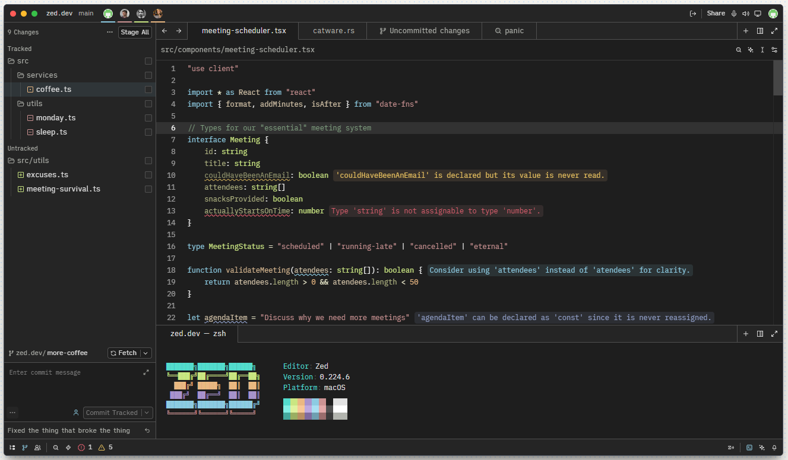
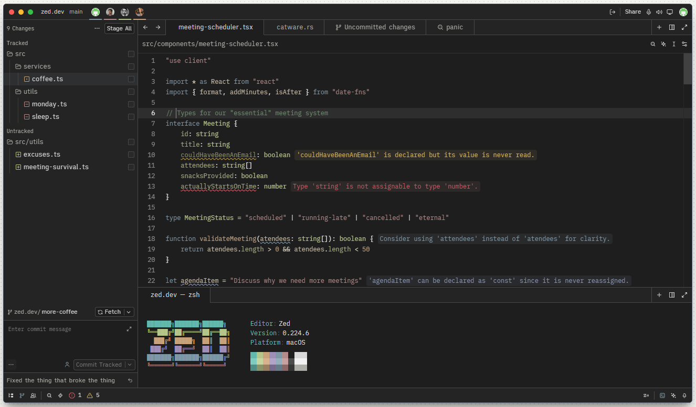

# Bullfinch

A colour theme with soft, pastel-like colours for various editors and tools.
Based on the [NightLion Eclipse](https://github.com/eclipse-color-theme/eclipse-color-theme/blob/master/com.github.eclipsecolortheme/themes/nightlion-aptana-theme.xml) theme.

<em>Zed — Bullfinch (left) and Bullfinch Muted (right)</em>

## Supported tools

- [Zed](https://zed.dev)
- [Windows Terminal](https://github.com/microsoft/terminal)
- [IntelliJ](https://www.jetbrains.com/idea/)

## Installation

### Zed

1. Open the Extensions page.
2. Click `Install Dev Extension` in the top right
3. Select the [zed/](zed/) folder

### Windows Terminal

1. Open Windows Terminal settings
2. Click `Open JSON file` in the bottom left
3. Find the `schemes` section
4. Copy in the scheme entry [windows-terminal/bullfinch.json](windows-terminal/bullfinch.json)

### IntelliJ / JetBrains IDEs

1. Open Settings
2. Go to `Editor` > `Color Scheme`
3. Click `⚙️` > `Import Scheme` > `IntelliJ IDEA color scheme (.icls)`
4. Select your preferred theme file from the [intellij/](intellij/) folder
